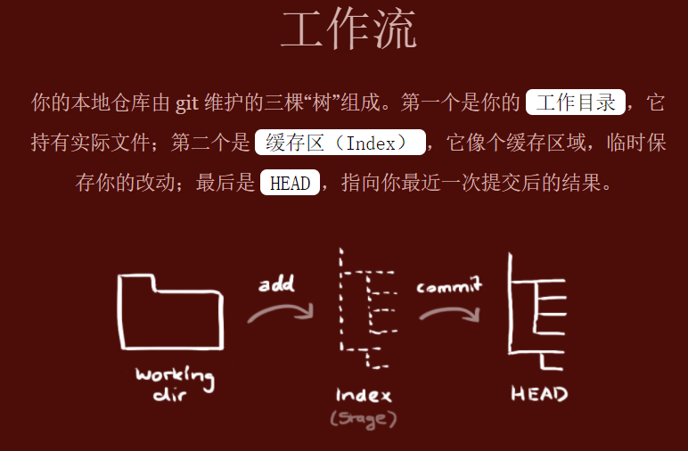

# GitNote

[TOC]

## git使用简单指南

https://www.bootcss.com/p/git-guide/

### 0.基本信息

**配置用户信息**

```
git config --global user.name "John Doe"
git config --global user.email johndoe@example.com
git config --list #查看
```


### 1.开始

**创建**

```
git init
git remote add origin <server>
git remote set-url origin git://new.url.here #重新设定
git remote remove origin #删除
```

**检出仓库**（就不用remote了）

```
git clone
```

### 2.简单工作



**添加到缓存区**

```
git add <filename>
git add .
```

**添加到HEAD**

```
git commit -m "代码提交信息"
```

**推送到远程**

```
git push origin <branch>
```

### 3.分支


**创建**

```
git checkout -b feature_x
```

**切换**

```
git checkout master
```

**删除**

```
git branch -d feature_x
```

### 4.更新与合并

**更新到最新改动**

```
git pull
```

**查看区别**

```
git diff <source_branch> <target_branch>
```

**合并其他分支到当前分支**

```
git merge <branch>
```

### 5.替换本地改动

**使用HEAD中的最新内容替换你的工作目录中的文件**

```
git checkout -- <filename>
```

**丢弃所有的本地改动与提交，到服务器上获取最新的版本并将本地主分支指向它**

```
git fetch origin
git reset --hard origin/master
```

### 6.标签

**执行如下命令以创建一个叫做 *1.0.0* 的标签**

```
git tag 1.0.0 1b2e1d63ff
```

**使用如下命令获取提交 ID**

```
git log
```

你也可以用该提交 ID 的少一些的前几位，只要它是唯一的

## Pro Git详细深入

https://git.oschina.net/progit/

# 实际使用注意事项

## 1.拉取远程的分支

**当本地有其他分支的代码仓库时**

* 需要本地分支和远程分支建立映射关系

git checkout -b 本地分支xxx  origin/远程分支xxx

使用这种方式会在本地仓库新建本地分支xxx，并自动切换到新建的本地分支xxx，当然了远程分支xxx的代码也拉取到了本地分支xxx中。采用这种方法建立的本地分支会和远程分支建立映射关系。

* 不需要本地分支和远程分支建立映射关系

git fetch origin 远程分支xxx:本地分支xxx

使用这种方式会在本地仓库新建本地分支xxx，但是并不会自动切换到新建的本地分支xxx，需要手动checkout，当然了远程分支xxx的代码也拉取到了本地分支xxx中。采用这种方法建立的本地分支不会和远程分支建立映射关系。

**当本地没有其他分支的代码仓库时**

* git clone -b 分支名 仓库地址

## 2.合并其他分支到当前分支

**查看区别**

```
git diff <source_branch> <target_branch>
```

**合并其他分支到当前分支**

```
git merge <branch>
```

## 3.放弃本地修改，强制拉取更新

两种：

**1.restore重置**

如果修改了代码但是没执行git add

```
git restore . #个别文件就写个别文件名
```

如果已经执行了git add操作，代码保存在暂存区，先取消暂存区变更

```
git restore --staged .
或者 git reset .
```

最后

```
git pull
```

**2.stash暂存**(推荐)

首先，将所有代码添加至暂存区：

```
git add .
```

然后，将代码临时保存：

```
git stash
```

此时代码会重置到修改前的状态，可以同步远程仓库区，完事儿。

```
git pull
```

同步后，如果还想继续修改原来的代码，可将临时代码恢复至工作区

```
git stash pop
```


