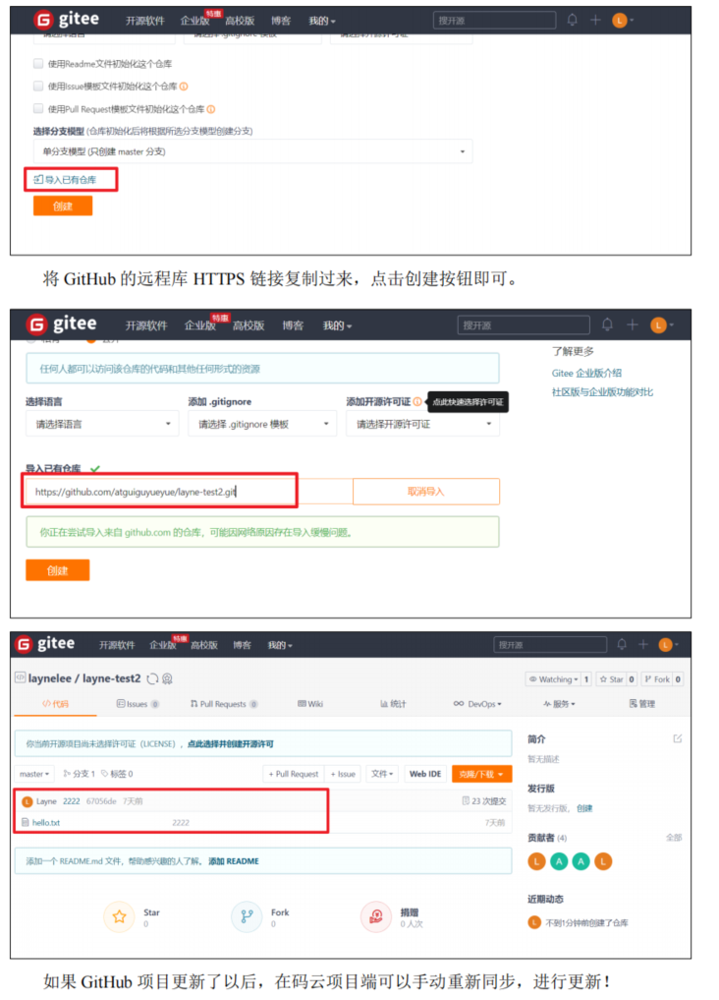
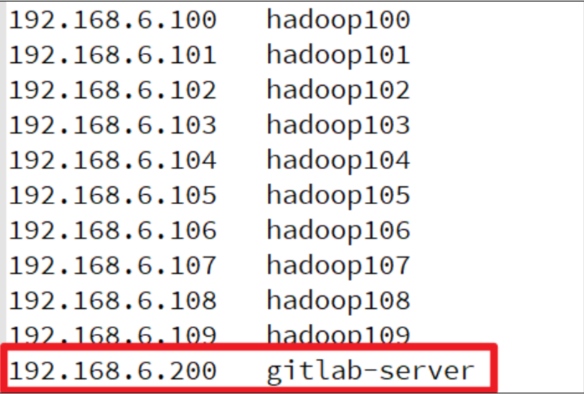

# Git系统学习

https://www.bilibili.com/video/BV1vy4y1s7k6?p=16&spm_id_from=pageDriver

## 第一章 GIT概述

**分布式版本控制系统**

工作区：写代码

git add

暂存区：临时存储

git commit

本地库：**历史版本**（无法删除的历史）

git push

**远程库（代码托管中心）：**

* 局域网：gitlab
* 互联网：github 以及 gitee

## 第二章 GIT安装

## 第三章 GIT常用命令

**3.1 用户签名**：区分提交代码的用户

```
git config --global user.name kongwenzhi
git config --global user.email 2936324669@qq.com
```

**3.2 初始化本地库**

```
git init
```

**3.3 查看本地库状态**

```
git status
```

**3.4 添加暂存区**

```
git add filename
git add .
```

**3.5 提交本地库**

```
git commit -m "日志信息" 文件名
```

**3.7 历史版本**

**查看历史版本**

```
git reflog #简单
git log #完整
```

**版本穿梭**

```
git reset --hard 版本号
```

## 第四章 GIT分支操作


**4.3 分支操作**

```
git branch 分支名 #创建分支
git branch -v #查看分支
git checkout 分支名 #切换分支
git merge 分支名 #将指定的分支合并到当前分支
```

**产生冲突**

冲突产生的原因：合并分支时，两个分支在**同一个文件的同一个位置**有两套完全不同的修改。Git 无法替我们决定使用哪一个。必须**人为决定**新代码内容。

**解决冲突**

编辑有冲突的文件，删除特殊符号，决定要使用的内容

特殊符号：<<<<<<< HEAD 当前分支的代码 ======= 合并过来的代码 >>>>>>> hot-fix

然后 git add . 和 commit

### 第五章 Git团队协作机制

**团队内协作：**


**跨团队协作**


## 第六章 GitHub操作


**创建远程仓库**

**远程仓库操作**

```
git remote -v #查看当前所有远程地址别名
git remote add 别名（跟仓库名字一样最好） 远程地址
git push 别名 本地分支
git clone 远程地址
git pull 远程库地址别名 远程分支名 # 相当于更新本地库
```

**跨团队协作**

fork一下

clone下来

修改push以后，提交pull request

对方同意就merge pull requet就好了

## 第七章 IDEA集成Git

## 第八章 IDEA集成GitHub

## 第九章 国内代码托管中心-码云 Gitee

**IDEA集成码云**

**码云复制GitHub项目**



## 第10章 自建代码托管平台 Gitlab

**官网地址：**

官网地址：https://about.gitlab.com/

安装说明：https://about.gitlab.com/installation/

**Gitlab安装：**

* 服务器准备

准备一个系统为 CentOS7 以上版本的服务器，要求内存 4G，磁盘 50G。关闭防火墙，并且配置好主机名和 IP，保证服务器可以上网。

此教程使用虚拟机：主机名：gitlab-server IP 地址：192.168.6.200

* 安装包准备

Yum 在线安装 gitlab- ce 时，需要下载几百 M 的安装文件，非常耗时，所以最好提前把所需 RPM 包下载到本地，然后使用离线 rpm 的方式安装。

下载地址：

```
https://packages.gitlab.com/gitlab/gitlabce/packages/el/7/gitlab-ce-13.10.2-ce.0.el7.x86_64.rpm
```

注：资料里提供了此 rpm 包，直接将此包上传到服务器/opt/module 目录下即可。

**编写安装脚本**

参考官网编写

给脚本增加权限

执行脚本

**初始化Gitlab服务**

```
gitlab-ctl reconfigure
```

**启动Gitlab服务**

```
 gitlab-ctl start
 gitlab-ctl stop
```

**使用浏览器访问**

使用主机名或者 IP 地址即可访问 GitLab 服务。需要提前配一下 windows 的 hosts 文件。



**创建远程库**

**IDEA集成Gitlab**

其他操作和前面的一样
